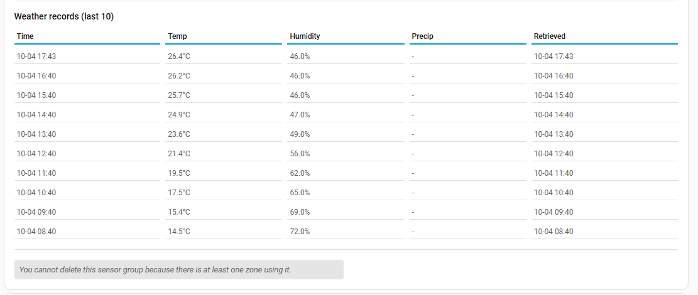

# Sensor group configuration

> Main page: [Configuration](configuration.md)<br/>
> Previous: [Module configuration](configuration-modules.md)<br/>
> Next: [Usage](usage.md)

Sensor groups define what sources provide the weather data to be collected and calculated on to determine irrigation duration. You can use any numeric Home Assistant sensor, regardless of its source. Additionally, if you [configured a weather service](installation-weatherservice.md) in this integration, you can retrieve the data from that as well.

## Adding a sensor group
Enter a sensor group name and select `Add sensor groups`. Your sensor group is added and you 'wire up' the sensors.

## Configuring a sensor group
Apart from changing the name, you can specify the source where to retrieve the weather data metrics. Metrics can be retrieved from a weather service (assuming you set it up), a sensor or a static value. When using a sensor or static value as a source, take care to make sure the unit the integration expects is the same as your sensor provides. You can choose which aggregation to use like average, maximum, minimum etc.

It's recommended to use actual sensor sources as much as you can and only rely on weather services as needed. If your zone is covered (such as a green house), of course you can set the total precipitation to 0.

The group's **Evapotranspiration** source is always the first field, and it decides what else is asked. Left on *None*, the zones calculate evapotranspiration from the weather, so the readings it needs are asked: temperature, dew point, humidity, pressure, wind speed and solar radiation. Given ready-made, by a weather service or a sensor, the other readings are not asked (a note says how many); rain stays. A plain sentence under each source explains what it does. The two choices are worded to tell them apart: **None (Smart Irrigation calculates it)** means the weather service, or your sensors, only supply the inputs of Smart Irrigation's own calculation, and **Ready-made ET₀ from the weather service** (or a sensor) means the value is taken as it comes and the other readings are not used.

The group also says when its zones and its source disagree: a zone calculated from the weather ignores a provided value, and a zone set to *provided* needs a source.

Some fields are only shown in advanced mode. **Total precipitation** (a rain gauge that adds up) is shown only in advanced mode, or when it already has a source. **How the readings are combined** (average, first, last, maximum, median, minimum, Riemann sum, sum, delta) is advanced mode only. The question **Input provides values in** is not asked when Home Assistant reports a unit the field can be read in; it is asked when Home Assistant reports nothing usable, or when the stored unit contradicts what it reports.

The following data can be provided:

| Data | Required | Available sources | Available units | Expected aggregation | Expected aggregation for continuous updates |
|---|---|---|---|--|--|
|**Current precipitation**|No|Weather Service<br/>Sensor<br/>Static value|in/h<br/>mm/h|Average|Riemann Sum|
|**Dewpoint**|Yes|Weather Service<br/>Sensor<br/>Static value|°C<br/>°F|Average|Last|
|**Evapotranspiration**|No|None (module will calculate it)<br/>Sensor<br/>Static value|in<br/>mm|Average|Last|
|**Humidity**|Yes|Weather Service<br/>Sensor<br/>Static value|%|Average|Last|
|**Total precipitation**|No|Sensor<br/>Static value|in<br/>mm|Delta|Delta|
|**Pressure** (*see notes below the table)|Yes|Weather Service<br/>Sensor<br/>Static value|hPa<br/>inch Hg<br/>millibar<br/>psi|Average|Last|
|**Solar Radiation**|No|Weather Service or None (requires module to estimate it)<br/>Radiation sensor<br/>Light sensor (lux)<br/>Static value|MJ/day/m2<br/>MJ/day/sq ft<br/>W/m2<br/>W/sq ft|Average|Riemann Sum|
|**Temperature**|Yes|Weather Service<br/>Sensor<br/>Static value|°C<br/>°F|Average|Last|
|**Wind speed**|Yes|Weather Service<br/>Sensor<br/>Static value|meter/s<br/>mile/h<br/>km/h<br/>knot|Average|Last|

Please note:
- If you use a [weather service](installation-weatherservice.md), make sure your home zone coordinates are set correctly so the data is correct. This is especially true if you set the coordinates manually in the configuration.yaml.
- Pressure can either be absolute or relative pressure: _absolute barometric pressure_ is the actual pressure measured at your location, while _relative barometric pressure_ is the pressure calculated at sea level. Check the source of your data to find out whether it provides absolute or relative pressure.
- Humidity for your sensor group is the air humidity / atmospheric humidity, _not_ soil humidity. Soil Humidity sensors do not provide useful information for this integration and cannot be used.
- **Greenhouse.** A sensor group has a greenhouse switch, for an enclosed environment: a greenhouse, a polytunnel, anything under glass or plastic. Turning it on takes precipitation out of the water balance for every zone using that group, and hides its rain fields, because rain measured outside waters nothing inside. Two things it does not decide for you, since neither can be guessed from the switch: give **Wind speed** a static value near 0, because the FAO-56 aerodynamic term assumes open air, and give **Solar Radiation** a light sensor, as below.

  The **weather-based irrigation skip** and its threshold are still settings for the whole installation rather than per sensor group, but a forecast of rain no longer pauses your greenhouse. A rain forecast is a statement about the sky, so when it would skip the run, zones in a greenhouse group go ahead and only the zones the rain can actually reach are held back for that run. Their deficit is untouched and rolls over to the next one, exactly as a skipped day would have left it. If nothing in your installation is under glass, nothing changes: the run is skipped as before, and no start event fires.
- **Greenhouses: a light sensor can stand in for a solar radiation sensor.** Under glass or plastic there is no usable sky, so a weather service has nothing relevant to say and the calculation loses the term that drives it. Most greenhouses have no pyranometer, but a light sensor is cheap and common. Set Solar Radiation's source to **Light sensor (lux)**, pick your illuminance entity, and the reading is converted to W/m2 and fed to the same Penman-Monteith calculation a real radiation sensor would feed.

  The conversion divides lux by the **luminous efficacy** of daylight, and that efficacy depends on the sky: roughly 112 lm/W under a clear sky and up to 125 or more under an overcast one. Smart Irrigation uses the model of Muneer and Kinghorn (1997), `Kg = 136.6 - 74.541 Kt + 57.3421 Kt²` in lm/W, where Kt is the clearness index: the global radiation over the radiation at the top of the atmosphere on a horizontal plane. The position of the sun at the sensor's coordinates, the date and the time, gives that ceiling, so the season and the hour are taken into account. There is no efficacy field to set. When the sun is lower than 5 degrees, or there are no coordinates, the middle of the range (113.7 lm/W) is used. A value stored by an older version is still honoured. Glass shifts the spectrum a little, which the model does not describe; the error stays within a few percent.

  Two other things to set for a greenhouse, which the integration does not infer for you: put Wind speed on a **static value** near 0, since the FAO-56 aerodynamic term assumes open air, and leave precipitation unmapped or static at 0, since it does not rain indoors.

  If you would rather not use this, a template sensor that converts your lux entity and is reported as `W/m2` reaches the same result through the Radiation sensor source.
- Wind speed needs to be measured at 2 meters height. If you are using Open Weather Map this is automatically done for you, but if you do not, you need to make sure the input sensor returns the wind speed at the correct height. You can use a template sensor like the following for this:
   ```yaml
   sensor:
     - platform: template
       sensors:
         wind_at_2m:
           friendly_name: Wind Speed at 2m
           value_template: "{{states('[name of your wind speed sensor (WSmeasured)]')|float()*(4.87/log((67.8*[height the wind speed was measured on in meters (H)])-5.42))}}"
   ```
- Total precipitation is the total amount of precipitation you want to take into account for the calculations. Use the 'Delta' aggregation type along with a sensor source that accumulates over a time period, usually named something like 'daily rain', 'weekly rain', or 'total rain'. The delta aggregation will correctly handle value resets (such as daily rain becoming zero at midnight). Keep in mind that the total precipitation is expected to be a total over the time period, not the current precipitation rate.
- Current precipitation is a *rate* (mm/h or in/h), while total precipitation is a *depth* (mm or in) accumulated over the interval. They are two different quantities and only one of them feeds the water balance: total precipitation is used when it has a value, and current precipitation is only used when it does not. That way a rain rate sensor is never counted on top of a rain gauge.
- **A weather service supplies the rain that fell, not the daily total.** A service's daily precipitation figure is a *forecast* for the part of the day that has not happened yet, so crediting it to the bucket would add rain that may never fall. If you use a weather service, leave total precipitation unset and let current precipitation come from the service. How the rain is measured depends on the service:
  - **Open-Meteo** keeps an hourly precipitation history. At every calculation the rain of each full hour since the last calculation is read from it and credited, so every hour counts once, however often weather data is collected. If the history cannot be read, the sampled rate is used as described below.
  - **OpenWeatherMap** reports the rain of the last hour and **Pirate Weather** the rate at this instant. That rate is collected at every update and integrated over the interval since the last calculation.
- **With OpenWeatherMap or Pirate Weather, set the automatic update interval to 1 hour or shorter.** These services report the last hour only, so collecting every few hours leaves the hours in between unobserved and rain falling in them is not counted. Only the hours actually observed are credited, so a coarse interval under-reports rain rather than scaling up what it happened to see. A warning is logged if the interval is longer than an hour. Open-Meteo's rain does not depend on the update interval.
- Map total precipitation when you have a rain gauge of your own that accumulates, which is more accurate than any service. It then takes precedence over the service's rate, so the two are never added together.
- With the 'Average' aggregation on current precipitation the mean rate over the interval is used, which is right for evenly spaced samples; with 'Riemann Sum' the samples are integrated over their own timestamps, which is more accurate when they are not evenly spaced.
- When using continuous updates, all aggregations are expected to be set to `Last`, with the exception of Solar Radiation and Current Precipitation, which need to be set to `Riemann Sum`, and Total Precipitation, which needs `Delta`.

## Weather service history
The table of the weather service history only shows values supplied by the weather service. A field whose source is a sensor appears as `-` there.

## Silent sensors
When a temperature, humidity or dew point source of a sensor group stops reporting for more than 6 hours, Smart Irrigation says so instead of calculating on old data without a word. Every 15 minutes it looks at the groups that automatic zones use:

- A **notice appears in Settings > Repairs**, one per sensor group, naming the silent sensors and since when. It disappears by itself when they report again.
- The event `smart_irrigation_weather_stale` is fired once when a field goes silent, and `smart_irrigation_weather_recovered` once when it is back, so an automation can notify you. See the [output contract](usage-output-contract.md).
- A sensor counts as reporting when its entity state was updated. A field read from the weather service counts as reporting when the group last received data from it successfully.
- Fields mapped to nothing or to a static value are not watched. After a restart of Home Assistant, a weather service is given the full 6 hours again before it can be called silent.

## Deleting a sensor group


Use the button at the bottom to delete a sensor group. Note you can only delete sensor groups that are not used by any [zones](configuration-zones.md).


Now you are ready to [use the integration](usage.md)!
> Main page: [Configuration](configuration.md)<br/>
> Previous: [Module configuration](configuration-modules.md)<br>
> Next: [Usage](usage.md)
