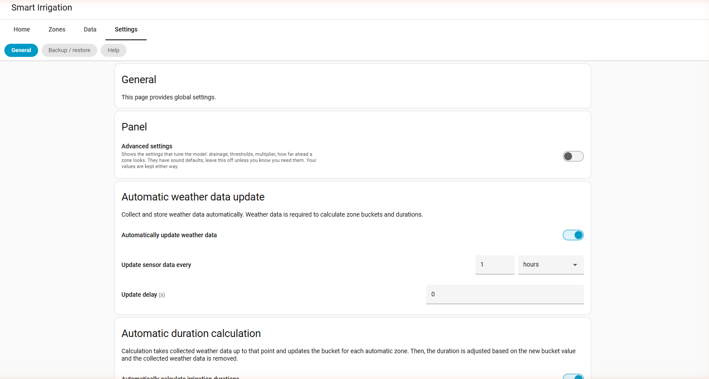

# Configuration

You use the Smart Irrigation panel to configure the integration. Make sure you [install](installation.md) it first.

## Four tabs

The panel used to have ten tabs, which is nine more than most people open twice
a year. It has four, each a group of pages: a group opens its first page and
shows the others on a second row. Nothing was removed and every address still
works.

1. **Home** — what is happening. [Info](usage-info.md): what will happen at the
   next start and why, whether it would be held back, where each zone stands
   right now, and the days ahead. Then **History**: what actually ran, by day,
   with durations and volumes.
2. **Zones** — [the zones](configuration-zones.md) of your irrigation system:
   what each waters, how it is calculated, and what it is short of.
3. **Data** — where the numbers come from. [Weather
   service](installation-weatherservice.md), then [sensor
   groups](configuration-sensor-groups.md): which sensor or service provides
   each value the calculation reads.
4. **Settings** — everything you set once.
   [General](configuration-general.md): schedules, start triggers, the skip
   conditions and the rest. Then **Backup / restore**, and **Help**.

Two pages are in no tab, and both are reachable.

- The [setup assistant](configuration-setup.md) is a button under **Settings**.
  It is for an installation that has nothing yet, so a tab inviting one that is
  already set up to set itself up was in the way.
- The [calculation engines](configuration-modules.md) page is not in the
  navigation at all, because a zone says how it is calculated and the engine
  behind that answer is created and reused for you. Its address still works and
  it appears under Settings while it is open.

## Standard and advanced

The panel comes in two depths, switched under **Settings > General**.

The **standard** panel keeps what a zone is: its name, what it waters with,
where its weather comes from, what it is short of. The **advanced** panel adds
the settings that tune the model — the drainage rate, the thresholds, the crop
factor, how far ahead a zone looks, cycle and soak — which have sound defaults
and are not improved by being met accidentally.

**An installation that already had zones when this arrived is on the advanced
panel**, because those settings were chosen on purpose and folding them away
would hide decisions its owner made. A fresh installation starts on the
standard one. Either way the choice is yours from then on, and nothing is lost
in either direction: the settings keep their values.

See also: [Closed-loop watering](configuration-closed-loop.md), which lets Smart Irrigation credit the bucket from real irrigation and, optionally, drive the valves itself.