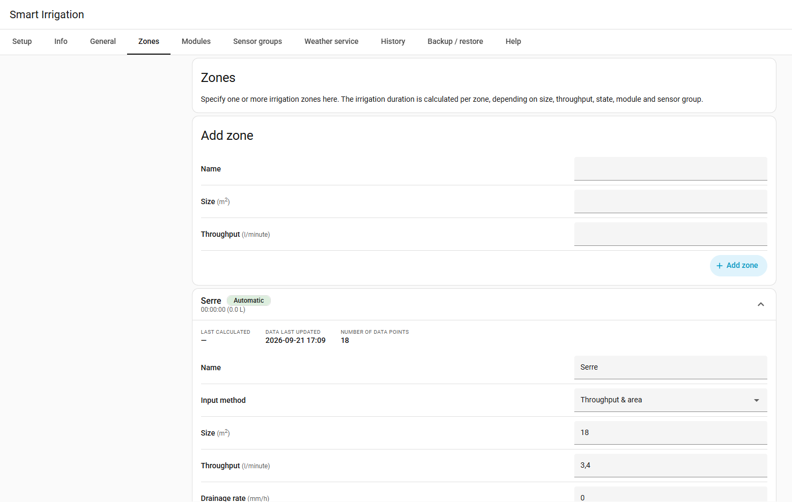
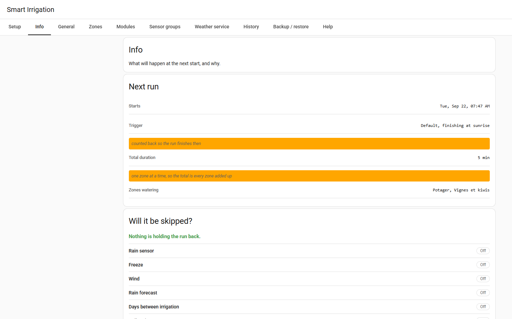
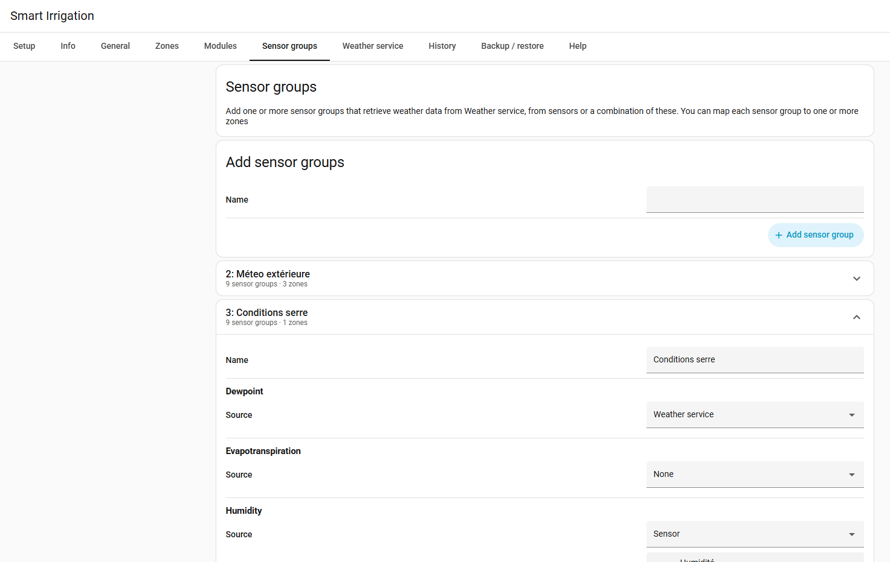

  

**Waters your garden with what the weather actually took out of it.**

Smart Irrigation works out how much water your plants lost to evaporation, subtracts the rain that fell, and tells your irrigation system how long to run. No fixed fifteen minutes, no watering the day after a storm, no guessing in a heatwave.

It is the official Smart Irrigation integration for Home Assistant, available by default in [HACS](https://hacs.xyz).

  

## What it does

- **It measures instead of guessing.** Each zone keeps a water balance in millimetres: evaporation out, rain in. When the balance says the soil is short, the zone waters exactly that much back, and not a drop more.
- **It uses the science, not a rule of thumb.** Evapotranspiration comes from the FAO-56 Penman-Monteith equation, the reference method in agronomy, fed by your own sensors, a weather service, or both.
- **It says why.** Every calculation shows its work: what was read, what was computed, and what it decided. The Info page shows the next start, and whether it would be held back and on what numbers.
- **It does not water when it should not.** Rain in the forecast, a rain sensor, frost, wind, or soil that is already wet: any of these can hold a run back, and a greenhouse ignores the ones that describe the sky.
- **It drives whatever you have.** A switch, a valve, Irrigation Unlimited, Irrigation-V5, or a Rain Bird, Hydrawise, Rachio, OpenSprinkler or B-hyve controller, through a [blueprint per brand](usage-controllers.md).

  
  

## How it works, in one paragraph

Water leaves the soil by evaporation and through the leaves. How fast depends on the sun, the temperature, the humidity and the wind, and that is what the FAO-56 equation computes from your weather data. Smart Irrigation adds that loss to a per-zone "bucket", subtracts the rain, and when the bucket is short by more than the threshold you set, it converts the missing millimetres into a run time from the zone's own area and flow. After the run, the bucket goes back to zero and the cycle starts again. The [how it works](how-it-works.md) page tells it properly, and the [calculation explanation](usage-info.md) on each zone shows the numbers of the day.

## What you need

- **Home Assistant**, and a way to turn your watering on and off from it.
- **Weather data**, which can be your own sensors, or a weather service: Open-Meteo needs no account, OpenWeatherMap and Pirate Weather need a free API key.
- **A few minutes.** The setup assistant asks what it needs, one question at a time, and creates the first zone for you.

Smart Irrigation does not open your valves by itself unless you ask it to: by design it calculates, and you decide what listens. A [dashboard card](usage-card.md) shows where each zone stands and can run one on demand.

> **Use this integration at your own risk.** We assume no responsibility for any inconvenience caused by using it. Always use common sense before deciding to irrigate on the numbers it provides: watering during heavy rain can cause flooding.

## Start here

- **[Install it](installation.md)**, which is a HACS download and a restart.
- Prefer to read first? **[How it works](how-it-works.md)** and **[which weather service to use](weather-services.md)**.
- Rather watch? The [official tutorial videos (English)](https://youtube.com/playlist?list=PLUHIAUPJHMiakbda92--fgb6A0hFReAo7&si=82Xc6mHoLDwFBfCP), and a [community tutorial in German](https://youtu.be/1AYLuIs7_Pw).
- Something not right? [Troubleshooting](usage-troubleshooting.md), the [discussions](https://github.com/altmenorg/HAsmartirrigation/discussions), or an [issue](https://github.com/altmenorg/HAsmartirrigation/issues) with a diagnostics file.

---

## Attribution

**Smart Irrigation** was created by [Jeroen ter Heerdt](https://github.com/jeroenterheerdt) and its contributors. All credit for the underlying evapotranspiration calculation engine and the original design goes to them. He transferred the project in June 2026, and this is where the official Smart Irrigation is maintained and released.

The integration is distributed under the [MIT License](https://github.com/altmenorg/HAsmartirrigation/blob/master/LICENSE), © Jeroen ter Heerdt and contributors.
